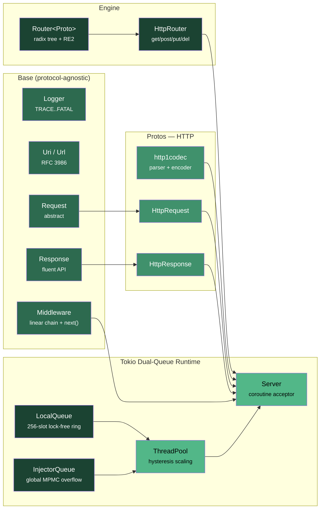

# WaveX

A modern, high-performance C++23 backend framework built for coroutine-native HTTP servers, Express.js-style pipeline execution, and extensible protocol support.

WaveX draws inspiration from **Rust's Actix Web** (hybrid radix-tree routing), **Tokio** (lock-free dual-queue runtime with hysteresis-based thread scaling), and **Express.js** (linear middleware chain with immediate response dispatching).

[](RELEASE_NOTES.md)
[](LICENSE)
[](https://en.cppreference.com/w/cpp/23)
[](https://cmake.org)

---

## Features

- **⚡ Coroutine-Native Engine** — Async handlers written with Asio C++23 coroutines (`co_await`, `asio::awaitable<void>`), zero callback boilerplate.
- **⚡ CRTP Zero-VTable Architecture** — Static compile-time polymorphism (`Request<Derived>`, `Response<Derived>`) eliminating virtual function pointers (`vptr`), saving memory and enabling zero-overhead direct dispatch.
- **🚀 Express.js-Style Linear Pipeline** — Iterative, non-recursive `run_chain()` middleware runner with immediate response dispatch (`res.send()` / `res.json()`) and zero-allocation socket pointer dispatch (`HttpResponse res(&socket)`).
- **🌳 Hybrid Radix-Tree Router** — High-performance radix-tree supporting static segments, dynamic parameters (`:id`), `{id:[0-9]+}` RE2 regex constraints, and catch-all wildcards (`*filepath`).
- **🧵 Tokio-Style Lock-Free Dual-Queue Runtime** —
  - **`LocalQueue`**: Bounded 256-slot lock-free ring buffer per worker thread for ultra-fast LIFO/FIFO work stealing.
  - **`InjectorQueue`**: Unbounded global MPMC queue with lock-free atomic size tracking for external tasks and overflow.
  - **Zero Request Loss on Scale-Down**: Retiring workers safely drain their remaining local ring tasks back into `InjectorQueue` on thread exit.
- **🛡 Pipeline Short-Circuiting** — Middleware rejection (e.g. `401 Unauthorized`) immediately sends the response while skipping downstream middlewares and route handlers.
- **📦 C++20 Modules & Headers** — Dual distribution models: standard C++ header inclusions (`#include <wavex/wavex.hpp>`) and modern C++20 Module partitions (`import wavex;`).
- **🧪 Interactive Postman Dev Server** — Pre-configured testing server ([tests/postman_demo_server.cpp](tests/postman_demo_server.cpp)) with ready-to-use Postman test endpoints.

---

## Quick Start

```cpp
#include <iostream>
#include <wavex/wavex.hpp>

using namespace wavex;

// Auth Guard Middleware
asio::awaitable<void> auth_guard(protos::http::HttpRequest &req, protos::http::HttpResponse &res, base::Next next) {
    auto auth_header = req.header("Authorization");
    if (!auth_header || *auth_header != "Bearer secret123") {
        res.status(401).json({{"error", "Unauthorized"}});
        co_return; // Immediate response sent, short-circuits pipeline!
    }
    co_await next();
}

int main() {
    auto &router = engine::HttpRouter::instance();

    // 1. Plain text endpoint
    router.get("/", [](protos::http::HttpRequest &, protos::http::HttpResponse &res) -> asio::awaitable<void> {
        res.status(200).send("Welcome to WaveX!");
        co_return;
    });

    // 2. JSON endpoint
    router.get("/api/json", [](protos::http::HttpRequest &, protos::http::HttpResponse &res) -> asio::awaitable<void> {
        res.status(200).json({{"status", "success"}, {"framework", "WaveX"}, {"version", wx_version}});
        co_return;
    });

    // 3. Protected endpoint with middleware
    router.get("/api/protected", {auth_guard}, [](protos::http::HttpRequest &, protos::http::HttpResponse &res) -> asio::awaitable<void> {
        res.status(200).json({{"secret", "Access Granted"}});
        co_return;
    });

    // 4. Wildcard catch-all endpoint
    router.get("/files/*filepath", [](protos::http::HttpRequest &req, protos::http::HttpResponse &res) -> asio::awaitable<void> {
        res.status(200).json({{"file", std::string(req.path())}});
        co_return;
    });

    server::Server server(router, "127.0.0.1", 8080);
    std::cout << "WaveX server running on http://127.0.0.1:8080\n";
    server.run();

    return 0;
}
```

---

## Architecture



---

## Component Status

| Component | Status | Description |
| :--- | :--- | :--- |
| `Base/Logger` | ✅ Complete | Levelled logger (TRACE, DEBUG, INFO, WARN, ERROR, FATAL) |
| `Base/Uri` / `Base/Url` | ✅ Complete | RFC 3986 URI encode/decode & URL query string parser |
| `Base/Request` | ✅ Complete | Protocol-agnostic CRTP request base (`Request<Derived>`, zero-vtable) |
| `Base/Response` | ✅ Complete | Protocol-agnostic CRTP response builder (`Response<Derived>`, zero-vtable, fluent API) |
| `Base/MiddleWare` | ✅ Complete | Coroutine-aware middleware template (`GenericMiddlewareFn`) & linear pipeline |
| `Engine/Router` | ✅ Complete | Protocol-agnostic radix tree with RE2 regex & wildcard (`*filepath`) matching |
| `Engine/HttpRouter` | ✅ Complete | HTTP method convenience routing (`get`, `post`, `put`, `del`, `patch`, etc.) |
| `Server/LocalQueue` | ✅ Complete | Per-worker 256-slot lock-free bounded ring buffer |
| `Server/InjectorQueue` | ✅ Complete | Global unbounded MPMC task overflow queue with lock-free atomic size tracking |
| `Server/ThreadPool` | ✅ Complete | Adaptive Tokio-style work-stealing thread pool with load hysteresis |
| `Server/Server` | ✅ Complete | Coroutine TCP server with master acceptor & slave worker pool |
| `protos/http/http1codec` | ✅ Complete | Zero-copy HTTP/1.x parser, encoder & response decoder |
| `protos/http/HttpRequest` | ✅ Complete | Concrete HTTP request for server parsing & client builder |
| `protos/http/HttpResponse` | ✅ Complete | Concrete HTTP response with zero-alloc socket writing & client parsing |
| `Client/HttpClient` | ✅ Complete | Async coroutine HTTP client for calling 3rd-party services (`get`, `post`, `send`) |

---

## Building & Testing

### Requirements

- **C++ Compiler**: GCC 13+, Clang 16+, or MSVC 19.36+ with C++23 enabled.
- **Build System**: CMake 3.20+.

### Build & Run Tests

```bash
# Clone the repository
git clone https://github.com/Jyotipm05/WaveX.git
cd WaveX

# Configure with tests enabled
cmake -B build -DWAVEX_TEST=ON
cmake --build build

# Run automated tests
ctest --test-dir build --output-on-failure
```

### Manual Testing with Postman

Launch the interactive dev server ([tests/postman_demo_server.cpp](tests/postman_demo_server.cpp)):

```bash
./build/tests/Debug/wavex_postman_server.exe
```

Then send HTTP requests in Postman to `http://127.0.0.1:8080` (see endpoint reference in [RELEASE_NOTES.md](RELEASE_NOTES.md)).

---

## Dependencies

| Library | Purpose | License |
| :--- | :--- | :--- |
| [Asio](https://think-async.com/Asio/) | Async I/O & C++ coroutines (standalone) | BSL-1.0 |
| [nlohmann/json](https://github.com/nlohmann/json) | Modern C++ JSON parsing & serialization | MIT |
| [Google RE2](https://github.com/google/re2) | Linear-time regex for route pattern constraints | BSD 3-Clause |
| [OpenSSL](https://www.openssl.org/) | TLS 1.3 encryption (Optional) | Apache-2.0 |

---

## Project Structure

```
include/wavex/
├── wavex.hpp                ← Main framework entry header
├── Base/
│   ├── Logger.hpp           ← Levelled logger
│   ├── Request.hpp          ← Abstract request base
│   ├── Response.hpp         ← Abstract response + fluent API
│   ├── MiddleWare.hpp       ← Middleware definition
│   ├── Uri.hpp              ← RFC 3986 URI utilities
│   └── Url.hpp              ← URL & query string parser
├── Engine/
│   ├── Router.hpp           ← Protocol-agnostic radix tree + RE2
│   └── HttpRouter.hpp       ← HTTP route shortcuts
├── Server/
│   ├── WorkStealingQueue.hpp← LocalQueue (lock-free ring) & InjectorQueue (global MPMC)
│   ├── ThreadPool.hpp       ← Tokio-style adaptive worker pool
│   └── Server.hpp           ← Coroutine TCP server
└── protos/
    └── http/
        ├── Methods.hpp      ← HTTP method enum
        ├── http1codec.hpp   ← Zero-copy HTTP/1.x parser + encoder
        ├── HttpRequest.hpp  ← Concrete HTTP request
        └── HttpResponse.hpp ← Concrete HTTP response

src/                         ← Implementation + C++20 module partitions (.ixx)
tests/                       ← Automated tests & postman_demo_server.cpp
cmake/                       ← CMake installation config
```

---

## License & Release

- **License**: WaveX is licensed under the [GNU Affero General Public License v3.0](LICENSE).
- **Third-Party Notices**: See [THIRD_PARTY_NOTICES.md](THIRD_PARTY_NOTICES.md) for dependency copyright statements.
- **Release Notes**: See RELEASE_NOTES for version `v0.1.0-alpha` details.

Copyright © 2026 Jyotipriya Mondal
